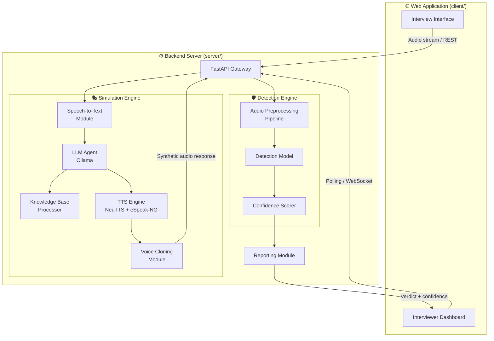

<div align="center">

<!-- ============================================================ -->
<!--                      BANNER / LOGO                           -->
<!-- ============================================================ -->


<br/>

[](https://www.python.org/)
[](https://www.typescriptlang.org/)
[](https://nextjs.org/)
[](https://fastapi.tiangolo.com/)
[](https://ollama.ai/)
[](./LICENSE)

<br/>

> **DeepMeet Guard** is a dual-purpose AI security platform designed for interview integrity.  
> It simultaneously demonstrates how AI-driven audio spoofing attacks operate in real-time,  
> and deploys a sophisticated detection system to identify and report fraudulent audio in live sessions.

<br/>

[📖 Documentation](#-setup-instructions) · [🚀 Quick Start](#-quick-start) · [🏗️ Architecture](#️-system-architecture) · [🤝 Contributors](#-contributors)

</div>

---

## 📋 Table of Contents

- [Overview](#-overview)
- [Motivation](#-motivation)
- [Features](#-features)
- [System Workflow](#-system-workflow)
- [System Architecture](#️-system-architecture)
- [Project Structure](#-project-structure)
- [Backend](#-backend-server)
- [Frontend](#-frontend-client)
- [API Overview](#-api-overview)
- [Setup Instructions](#-setup-instructions)
- [Running the Project](#-running-the-project)
- [Environment Variables](#-environment-variables)
- [Troubleshooting](#-troubleshooting)
- [Technologies Used](#️-technologies-used)
- [Future Improvements](#-future-improvements)
- [Contributors](#-contributors)
- [License](#-license)

---

## 🔍 Overview

**DeepMeet Guard** is a graduation research platform that addresses one of the most pressing challenges in modern remote hiring: **AI-powered audio fraud during online interviews**.

The system is engineered with two deeply integrated subsystems:

| Subsystem | Role | Description |
|---|---|---|
| 🎭 **Simulation Engine** | Attacker Side | Demonstrates how an AI assistant can autonomously respond to interview questions using a candidate-supplied knowledge base, generating synthetic voice output indistinguishable from a real human |
| 🛡️ **Detection Engine** | Defender Side | Analyzes incoming audio streams in real-time to determine whether the speaker's voice is AI-generated, flagging anomalies and reporting them to the interviewer |

This dual-sided architecture makes DeepMeet Guard both a **security research tool** and a **corporate fraud prevention platform**.

---

## 💡 Motivation

The rapid commoditization of voice synthesis and large language models has made it trivially easy for bad actors to impersonate candidates in remote interviews. A technically sophisticated interviewee can now:

- Clone any target voice from a short audio sample
- Deploy an LLM that answers domain-specific questions in real-time
- Route synthesized audio through virtual audio drivers undetected

Existing interview platforms offer **no protection** against this attack vector.

DeepMeet Guard was built to:

1. **Demonstrate** the full attack surface through a working simulation
2. **Defend** against it through a real-time audio integrity analysis pipeline
3. **Inform** organizations about the maturity and accessibility of this threat

---

## ✨ Features

### 🎭 Simulation Side
- 🎙️ **Real-time Speech-to-Text (STT)** — Transcribes the interviewer's spoken question with high accuracy
- 🧠 **LLM-powered Response Generation** — Understands the question and generates a contextually aware answer grounded in the candidate's pre-uploaded knowledge base
- 🔊 **Text-to-Speech + Voice Cloning** — Synthesizes a realistic voice response mimicking the candidate's enrolled voice profile
- 📚 **Knowledge Base Integration** — Candidate-defined knowledge documents serve as the ground truth for all LLM answers
- ⚡ **Low-latency End-to-End Pipeline** — Optimized for near-real-time performance in live interview conditions

### 🛡️ Detection Side
- 🔬 **Audio Integrity Analysis** — Analyzes audio segments to determine authenticity
- 📊 **Confidence Scoring** — Returns a probability-based verdict with confidence metrics
- 🚨 **Interviewer Reporting** — Delivers detection results directly to the interviewer's interface
- 🔄 **Continuous Monitoring** — Operates across the full duration of the interview session

### 🌐 Platform
- 🖥️ **Full-Stack Web Application** — A unified interface for both simulation and detection workflows
- 🔌 **REST API Architecture** — Both engines exposed through clean, documented API endpoints
- 🤝 **Multi-Agent Workflow** — Coordinated pipeline of specialized AI agents handling each stage

---

## 🔄 System Workflow

### Simulation Pipeline

```
Interviewer speaks
       │
       ▼
  [STT Module]
  Transcribes speech to text
       │
       ▼
  [LLM Agent]
  Understands the question
  Queries the candidate's knowledge base
  Generates a tailored answer
       │
       ▼
  [TTS + Voice Cloning Module]
  Synthesizes response in the candidate's cloned voice
       │
       ▼
  Fake audio played back to the interviewer
```

### Detection Pipeline

```
Audio stream from interviewee
       │
       ▼
  [Audio Preprocessing]
  Segmentation & feature extraction
       │
       ▼
  [Detection Engine]
  Analyzes audio for authenticity signals
       │
       ▼
  [Verdict + Confidence Score]
  REAL / AI-GENERATED
       │
       ▼
  [Reporting Module]
  Result delivered to interviewer dashboard
```

---

## 🏗️ System Architecture



---

## 📁 Project Structure

```
DeepMeet-Gaurd/
│
src/
├── 📁 assets/
│   ├── 📁 user_texts/
│   └── 📁 user_voices/
│
├── 📁 client/                  # Next.js Frontend
│   ├── 📁 app/
│   ├── 📁 components/
│   ├── 📁 hooks/
│   ├── 📁 lib/
│   ├── 📁 public/
│   └── 📁 styles/
│
└── 📁 server/                  # Python Backend
    ├── 📁 controllers/
    ├── 📁 helpers/
    ├── 📁 infrastructure/
    ├── 📁 models/
    ├── 📁 routers/
    ├── 📁 usecases/
    └── 📁 utilities/          
│
├── LICENSE
└── README.md
```

---

## 🐍 Backend (Server)

The server is a **Python 3.11** application built on **FastAPI**, orchestrating three specialized AI subsystems:

### Simulation Engine
| Component | Technology | Role |
|---|---|---|
| STT | Custom Whisper-based model | Converts interviewer speech to text |
| LLM | Ollama (tunneled via Colab) | Generates intelligent answers from knowledge base |
| TTS | NeuTTS + eSpeak-NG + phonemizer | Synthesizes natural speech from text |
| Voice Cloning | Custom VC module | Applies candidate's voice profile to TTS output |

### Detection Engine
| Component | Role |
|---|---|
| Audio Preprocessing | Segments and extracts features from raw audio |
| Detection Model | Analyzes audio for authenticity at inference time |
| Confidence Scorer | Outputs a probability verdict (REAL / AI-GENERATED) |
| Reporting Module | Delivers results to the interviewer's session |

---

## 🌐 Frontend (Client)

The client is a **Next.js 14** application written in **TypeScript**, providing:

- **Interviewer View** — Real-time audio monitoring dashboard with live detection verdict display
- **Candidate View** — Simulation interface including knowledge base upload and voice enrollment
- **Session Management** — Interview session creation, joining, and lifecycle control
- **API Integration** — Communicates with the FastAPI backend through a typed REST client

The frontend is structured using the **Next.js App Router** convention with component-driven architecture.

---

## 📡 API Overview

All endpoints are served by the FastAPI backend. Interactive docs are available at `/docs` when the server is running.

<details>
<summary><strong>🎭 Simulation Endpoints</strong></summary>

| Method | Endpoint | Description |
|---|---|---|
| `POST` | `/simulation/transcribe` | Submit audio for STT transcription |
| `POST` | `/simulation/answer` | Generate LLM answer from transcription |
| `POST` | `/simulation/synthesize` | Synthesize and clone voice audio |
| `POST` | `/simulation/knowledge` | Upload candidate knowledge base |

</details>

<details>
<summary><strong>🛡️ Detection Endpoints</strong></summary>

| Method | Endpoint | Description |
|---|---|---|
| `POST` | `/detection/analyze` | Submit audio segment for authenticity analysis |
| `GET` | `/detection/report/{session_id}` | Retrieve detection report for a session |

</details>

<details>
<summary><strong>🔧 Utility Endpoints</strong></summary>

| Method | Endpoint | Description |
|---|---|---|
| `GET` | `/health` | Server health check |
| `GET` | `/docs` | Interactive Swagger API documentation |

</details>

---

## ⚙️ Setup Instructions

### Prerequisites

| Requirement | Version |
|---|---|
| Python | 3.11 |
| Node.js | 18+ |
| Git | Latest |
| winget *(Windows only)* | Latest |
| Google Account | For Colab (Ollama setup) |

---

### 🐍 Server Setup

#### Step 1 — Create Python Virtual Environment

```bash
# Navigate to the server directory
cd src/server

# Create a virtual environment with Python 3.11
python3.11 -m venv venv
```

Activate the environment:

```bash
# Windows
venv\Scripts\activate

# Linux / macOS
source venv/bin/activate
```

---

#### Step 2 — Install eSpeak-NG (TTS Dependency)

> ⚠️ **Windows only.** Linux users can install via `sudo apt install espeak-ng`.

Install the eSpeak-NG binary using winget:

```bash
winget install -e --id eSpeak-NG.eSpeak-NG
```

Set the required environment variables (run in Command Prompt as Administrator):

```cmd
setx PHONEMIZER_ESPEAK_LIBRARY "C:\Program Files\eSpeak NG\libespeak-ng.dll"
setx PHONEMIZER_ESPEAK_PATH "C:\Program Files\eSpeak NG"
```

Verify the installation:

```bash
espeak-ng --version
```

Verify Python integration:

```bash
python -c "from phonemizer import phonemize; print(phonemize('hello world', language='en-us'))"
```

**Expected output:**
```
h ə l oʊ w ɜː l d
```

> 💡 **Note:** The repository already includes all required NeuTTS-related files. Do **not** clone or download any additional TTS repositories.

---

#### Step 3 — Download the STT Model

Download the STT model from the following Google Drive link:

📥 **[Download STT Model](https://drive.google.com/drive/folders/1Ju97rhGqmOG9F2UWQJQ6dRWrd1E3HBRK?usp=sharing)**

After downloading:

1. Extract the archive
2. Place the extracted folder inside:

```
src/server/infrastructure/stt/
```

No additional configuration is required after placement.

---

#### Step 4 — Configure Environment Variables

```bash
cp .env.example .env
```

Open `.env` and fill in all required values. See the [Environment Variables](#-environment-variables) section for a full reference.

---

#### Step 5 — Ollama LLM Setup (via Google Colab)

The LLM backend uses Ollama served through a public tunnel from Google Colab.

1. Open the notebook located at:
   ```
   src/server/notebooks/ollama_setup.ipynb
   ```
2. Upload it to **Google Colab** and run all cells
3. When prompted, insert your API key
4. After execution, **copy the generated public URL**
5. Paste the URL into your `.env` file under the appropriate key

---

#### Step 6 — Install Python Dependencies

```bash
pip install -r requirements.txt
```

> ✅ All required Python packages are already listed in `requirements.txt`. Do **not** install additional packages manually.

---

### 🌐 Client Setup

#### Step 1 — Navigate to the Client Directory

```bash
cd src/client
```

#### Step 2 — Install Node.js Dependencies

```bash
npm install
```

> The project uses **npm** as the package manager. Ensure Node.js 18+ is installed.

#### Step 3 — Configure Client Environment

```bash
cp .env.example .env.local
```

Fill in the backend API base URL and any other required values.

---

## 🚀 Running the Project

### Start the Backend Server

```bash
# From src/server/ with venv activated
cd src/server
uvicorn main:app --reload --host 0.0.0.0 --port 8000
```

The API will be available at: `http://localhost:8000`  
Interactive docs: `http://localhost:8000/docs`

---

### Start the Frontend

```bash
# From src/client/
cd src/client
npm run dev
```

The web application will be available at: `http://localhost:3000`

---

### Build for Production

```bash
# Build the Next.js client
cd src/client
npm run build
npm start
```

---

## 🔐 Environment Variables

The following environment variables must be set in `src/server/.env`:

| Variable | Description | Required |
|---|---|---|
| `OLLAMA_BASE_URL` | Public tunnel URL generated by the Colab notebook | ✅ |
| `OLLAMA_MODEL` | Ollama model identifier (e.g. `llama3`) | ✅ |
| `STT_MODEL_PATH` | Path to the downloaded STT model directory | ✅ |
| `TTS_VOICE_SAMPLE_DIR` | Directory containing candidate voice samples | ✅ |
| `API_SECRET_KEY` | Secret key for API authentication | ✅ |
| `DEBUG` | Enable debug mode (`true` / `false`) | ⚙️ Optional |

> Refer to `.env.example` for the full list of variables with inline documentation.

---

## 🛠️ Troubleshooting

<details>
<summary><strong>❌ phonemizer raises ImportError or library not found</strong></summary>

Ensure you have set the environment variables correctly after installing eSpeak-NG:

```cmd
setx PHONEMIZER_ESPEAK_LIBRARY "C:\Program Files\eSpeak NG\libespeak-ng.dll"
setx PHONEMIZER_ESPEAK_PATH "C:\Program Files\eSpeak NG"
```

Then **restart your terminal** so the new environment variables take effect.

</details>

<details>
<summary><strong>❌ STT model not found</strong></summary>

Ensure the model is placed at:
```
src/server/infrastructure/stt/
```
The folder must contain all extracted model files, not a nested sub-folder.

</details>

<details>
<summary><strong>❌ Ollama LLM not responding</strong></summary>

- Verify that the Colab notebook is still running (Colab sessions time out)
- Re-run the notebook and update `OLLAMA_BASE_URL` in your `.env` with the new URL
- Check your API key is correctly inserted in the notebook before execution

</details>

<details>
<summary><strong>❌ Frontend cannot connect to backend</strong></summary>

- Ensure the FastAPI server is running on port `8000`
- Check that `NEXT_PUBLIC_API_URL` in `src/client/.env.local` points to `http://localhost:8000`
- Verify CORS is enabled in the FastAPI configuration

</details>

<details>
<summary><strong>❌ pip install fails with dependency conflicts</strong></summary>

Ensure you are using **Python 3.11** specifically. Other Python versions may cause dependency resolution failures.

```bash
python --version   # Must output Python 3.11.x
```

</details>

---

## 🛠️ Technologies Used

### Backend
| Technology | Purpose |
|---|---|
| **Python 3.11** | Core server language |
| **FastAPI** | REST API framework |
| **Uvicorn** | ASGI server |
| **Ollama** | Local LLM inference |
| **NeuTTS** | Neural text-to-speech synthesis |
| **eSpeak-NG + phonemizer** | Text-to-phoneme conversion for TTS |
| **Whisper-based STT** | Speech-to-text transcription |
| **Jupyter Notebook** | Ollama Colab setup workflow |

### Frontend
| Technology | Purpose |
|---|---|
| **Next.js 14** | Full-stack React framework |
| **TypeScript** | Type-safe frontend development |
| **Tailwind CSS** | Utility-first styling |
| **React** | UI component library |

### Infrastructure & AI
| Technology | Purpose |
|---|---|
| **Google Colab** | Cloud LLM hosting via Ollama tunnel |
| **REST API** | Communication between client and server |

---

## 🔮 Future Improvements

- [ ] **WebRTC Integration** — Replace REST audio uploads with real-time audio streaming via WebRTC for sub-second latency
- [ ] **Multi-Language Support** — Extend STT, LLM, and TTS components to support additional languages beyond English
- [ ] **Browser Plugin** — Package the detection engine as a browser extension for seamless integration with Google Meet, Zoom, and Teams
- [ ] **Session Analytics Dashboard** — Provide detailed post-session reports with timeline-annotated detection events
- [ ] **Containerization** — Full Docker + Docker Compose deployment for one-command setup
- [ ] **CI/CD Pipeline** — Automated testing and deployment via GitHub Actions
- [ ] **Mobile Client** — React Native companion app for on-device monitoring
- [ ] **Enterprise API** — Webhook-based integration for ATS and HR platforms

---


<div align="center">


**DeepMeet Guard** · Built to expose the threat. Engineered to stop it.

[](https://github.com/3bdelmoemn/DeepMeet-Gaurd)
[](./LICENSE)

*For research and educational purposes. Use responsibly.*

</div>