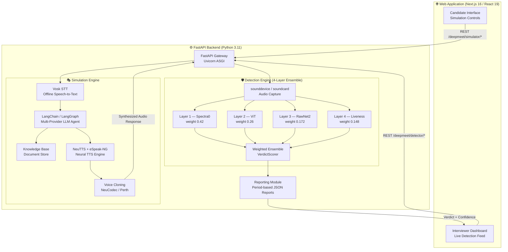

<div align="center">


<br/>

[](https://www.python.org/)
[](https://www.typescriptlang.org/)
[](https://nextjs.org/)
[](https://react.dev/)
[](https://fastapi.tiangolo.com/)
[](https://langchain.com/)
[](https://pytorch.org/)
[](./LICENSE)

<br/>

> **DeepMeet Guard** is a dual-purpose AI security research platform targeting one of the most critical emerging threats in remote hiring:  
> **AI-powered audio fraud during live online interviews.**  
> It simultaneously *demonstrates* how AI-driven audio spoofing attacks operate in real-time,  
> and *deploys* a multi-layer detection system to identify and report fraudulent audio to the interviewer.

<br/>

[📖 Setup Guide](#️-setup-instructions) · [🚀 Quick Start](#-running-the-project) · [🏗️ Architecture](#️-system-architecture) · [📡 API Reference](#-api-reference) · [🤝 Contributors](#-contributors)

</div>

---

## 📋 Table of Contents

- [Overview](#-overview)
- [Motivation](#-motivation)
- [Key Features](#-key-features)
- [System Workflow](#-system-workflow)
- [System Architecture](#️-system-architecture)
- [Project Structure](#-project-structure)
- [Backend — Server](#-backend--server)
- [Frontend — Client](#-frontend--client)
- [API Reference](#-api-reference)
- [Setup Instructions](#️-setup-instructions)
- [Running the Project](#-running-the-project)
- [Environment Variables](#-environment-variables)
- [Technologies Used](#️-technologies-used)
- [Troubleshooting](#-troubleshooting)
- [Future Improvements](#-future-improvements)
- [Contributors](#-contributors)
- [License](#-license)

---

## 🔍 Overview

**DeepMeet Guard** is a graduation research platform engineered with two deeply integrated AI subsystems:

| Subsystem | Side | Description |
|---|---|---|
| 🎭 **Simulation Engine** | Attacker | Demonstrates how an AI assistant autonomously responds to interview questions using a candidate-supplied knowledge base, generating synthetic voice output indistinguishable from a real human |
| 🛡️ **Detection Engine** | Defender | Analyzes incoming audio streams in real-time using a **4-layer ensemble model** to determine whether the speaker's voice is AI-generated, flagging anomalies and reporting verdicts to the interviewer |

This dual-sided architecture makes DeepMeet Guard both a **security research tool** and a **corporate fraud prevention platform**.

---

## 💡 Motivation

The rapid commoditization of voice synthesis and large language models has made it trivially easy for bad actors to impersonate candidates in remote interviews. A technically sophisticated actor can now:

- Clone any target voice from a short audio sample
- Deploy an LLM that answers domain-specific questions in real-time
- Route synthesized audio through virtual audio drivers — completely undetected

Existing interview platforms offer **no protection** against this attack vector.

DeepMeet Guard was built to:

1. **Demonstrate** the full attack surface through a working, end-to-end simulation
2. **Defend** against it through a real-time, multi-model audio integrity analysis pipeline
3. **Inform** organizations about the maturity and accessibility of this threat

---

## ✨ Key Features

### 🎭 Simulation Engine (Attacker Side)
- 🎙️ **Real-time Speech-to-Text (STT)** — Transcribes the interviewer's spoken question using a Vosk-based offline model
- 🧠 **Multi-Provider LLM Response Generation** — Supports OpenAI, Gemini, Claude, Cohere, and Ollama, grounded in the candidate's knowledge base via LangChain
- 🔊 **Neural Text-to-Speech (TTS)** — Synthesizes natural speech using NeuCodec-based NeuTTS with eSpeak-NG phonemization
- 🧬 **Zero-Shot Voice Cloning** — Applies the candidate's enrolled voice profile to TTS output for seamless impersonation
- 📚 **Knowledge Base Integration** — Candidate-defined knowledge documents serve as the ground truth for all LLM answers
- ⚡ **Low-latency Pipeline** — Optimized for near-real-time performance in live interview conditions

### 🛡️ Detection Engine (Defender Side)
- 🔬 **4-Layer Ensemble Detection** — Combines Spectra0, ViT, RawNet2, and liveness detection models with configurable weighted voting
- 📊 **Confidence Scoring** — Returns a weighted probability verdict: `REAL` / `AI-GENERATED`
- 🚨 **Interviewer Reporting** — Delivers period-by-period detection results directly to the interviewer's interface
- 🔄 **Continuous Session Monitoring** — Captures and analyzes audio in configurable time periods across the full interview

### 🌐 Platform
- 🖥️ **Full-Stack Web Application:** — Unified Next.js interface for both simulation and detection workflows
- 🔌 **RESTful API** — Clean, documented FastAPI endpoints with automatic Swagger UI
- 🤝 **Multi-Agent LangGraph Workflow** — Coordinated pipeline of specialized AI agents handling each stage of simulation

---

## 🔄 System Workflow

### Simulation Pipeline

```
Interviewer speaks
       │
       ▼
  [STT Module — Vosk]
  Transcribes speech to text offline
       │
       ▼
  [LangChain + LangGraph Agent]
  Retrieves relevant context from candidate's knowledge base
  Generates a tailored answer via configured LLM provider
       │
       ▼
  [NeuTTS + eSpeak-NG Phonemizer]
  Converts text to natural speech with phoneme-level control
       │
       ▼
  [Voice Cloning Module]
  Applies candidate's reference voice to synthesized audio
       │
       ▼
  Fake audio streamed back to the interviewer
```

### Detection Pipeline

```
Audio stream captured from interviewee
       │
       ▼
  [Audio Capture — sounddevice / soundcard]
  Segments audio into configurable time periods
       │
       ▼
  [Parallel 4-Layer Detection]
  ┌─────────────┬──────────────┬───────────────┬──────────────────┐
  │  Spectra0   │    ViT       │   RawNet2     │ Behaviour/Live.  │
  │ (w=0.42)    │ (w=0.26)    │  (w=0.172)    │  (w=0.148)       │
  └─────────────┴──────────────┴───────────────┴──────────────────┘
       │
       ▼
  [Weighted Ensemble Scorer]
  Aggregates layer verdicts into final confidence score
       │
       ▼
  [Reporting Module]
  Result + confidence delivered to interviewer dashboard per period
```

---

## 🏗️ System Architecture


```mermaid
graph TD
    subgraph CLIENT ["🌐 Web Application (Next.js 16 / React 19)"]
        UI[Candidate Interface\nSimulation Controls]
        Dashboard[Interviewer Dashboard\nLive Detection Feed]
    end

    subgraph SERVER ["⚙️ FastAPI Backend (Python 3.11)"]
        API[FastAPI Gateway\nUvicorn ASGI]

        subgraph SIM ["🎭 Simulation Engine"]
            STT[Vosk STT\nOffline Speech-to-Text]
            LLM[LangChain / LangGraph\nMulti-Provider LLM Agent]
            KB[Knowledge Base\nDocument Store]
            TTS[NeuTTS + eSpeak-NG\nNeural TTS Engine]
            VC[Voice Cloning\nNeuCodec / Perth]
        end

        subgraph DET ["🛡️ Detection Engine (4-Layer Ensemble)"]
            CAP[sounddevice / soundcard\nAudio Capture]
            L1[Layer 1 — Spectra0\nweight 0.42]
            L2[Layer 2 — ViT\nweight 0.26]
            L3[Layer 3 — RawNet2\nweight 0.172]
            L4[Layer 4 — Liveness\nweight 0.148]
            SCORE[Weighted Ensemble\nVerdictScorer]
        end

        REPORT[Reporting Module\nPeriod-based JSON Reports]
    end

    UI -->|REST /deepmeet/simulator/*| API
    Dashboard -->|REST /deepmeet/detector/*| API

    API --> STT
    STT --> LLM
    LLM --> KB
    LLM --> TTS
    TTS --> VC
    VC -->|Synthesized Audio Response| API

    API --> CAP
    CAP --> L1 & L2 & L3 & L4
    L1 & L2 & L3 & L4 --> SCORE
    SCORE --> REPORT
    REPORT -->|Verdict + Confidence| Dashboard
```

---

## 📁 Project Structure

```
DeepMeet-Gaurd/
├── LICENSE
├── README.md
└── src/
    ├── main.py                        # FastAPI application entry point
    ├── requirements.txt               # Python dependencies
    ├── .env.example                   # Environment variable template
    │
    ├── assets/
    │   ├── simulator_assets/          # Candidate voice samples & knowledge base storage
    │   └── detector_assets/           # Meeting session audio & detection reports
    │
    ├── client/                        # Next.js 16 Frontend
    │   ├── app/                       # App Router pages & layouts
    │   ├── components/                # Reusable React components (shadcn/ui + Radix UI)
    │   ├── hooks/                     # Custom React hooks
    │   ├── lib/                       # Utility functions & API client
    │   ├── styles/                    # Global CSS styles
    │   ├── public/                    # Static assets
    │   ├── package.json
    │   ├── tsconfig.json
    │   └── next.config.mjs
    │
    └── server/                        # Python FastAPI Backend
        ├── app_defaults/              # Default reference audio & text for TTS
        ├── controllers/               # Request handling logic
        ├── helpers/                   # Configuration loaders & shared utilities
        ├── infrastructure/            # Model files: STT (Vosk), liveness detection
        ├── models/
        │   ├── enums/                 # Shared enumerations
        │   ├── interfaces/            # Abstract base classes
        │   └── schemas/               # Pydantic request/response schemas
        ├── routers/                   # FastAPI route definitions
        │   ├── health.py              # GET /health
        │   ├── data.py                # POST /deepmeet/simulator/data/*
        │   ├── setup.py               # POST /deepmeet/simulator/setup/*
        │   ├── communication.py       # POST /deepmeet/simulator/communication/*
        │   └── detection.py           # POST|GET /deepmeet/detector/*
        ├── services/
        │   ├── simulator.py           # Simulator service singleton
        │   └── detector.py            # Detector service singleton
        ├── usecases/                  # Business logic layer
        ├── utilities/                 # Audio processing, session management helpers
        └── views/                     # Streamlit debug/monitoring views
```

---

## 🐍 Backend — Server

The server is a **Python 3.11** application built on **FastAPI**, orchestrating two specialized AI subsystems.

### Simulation Engine Components

| Component | Technology | Role |
|---|---|---|
| STT | Vosk `0.3.45` + pyspellchecker | Offline speech-to-text transcription |
| LLM Orchestration | LangChain `1.0` + LangGraph `1.0` | Multi-agent pipeline with RAG over knowledge base |
| LLM Providers | OpenAI, Gemini, Claude, Cohere, Ollama | Configurable via `LLM_PROVIDER` env var |
| TTS | NeuCodec `≥0.0.4` + eSpeak-NG + phonemizer `3.3` | Neural text-to-speech synthesis |
| Voice Cloning | resemble-perth `1.0.1` | Zero-shot voice profile application |

### Detection Engine — 4-Layer Ensemble

| Layer | Model | Weight | Technology |
|---|---|---|---|
| Layer 1 | **Spectra0** | `0.42` | Custom spectrogram-based detector |
| Layer 2 | **ViT** | `0.26` | Vision Transformer on ConstantQ features |
| Layer 3 | **RawNet2** | `0.172` | End-to-end raw waveform anti-spoofing |
| Layer 4 | **Behaviour Liveness** | `0.148` | XGBoost / sklearn behavioural liveness |

Additional libraries: `Jabberjay 0.0.11`, `librosa 0.11`, `torchaudio ≥2.11`, `ONNX Runtime 1.23`, `transformers`, `scikit-learn 1.8`, `xgboost`

### Server Configuration (FastAPI)

```python
# main.py
app = FastAPI(title="DeepMeet Guard API", version="1.0.0")

# CORS origins
allow_origins = ["http://localhost:3000", "http://localhost:3001", "http://127.0.0.1:3000"]
```

---

## 🌐 Frontend — Client

The client is a **Next.js 16** application written in **TypeScript 5.7** with **React 19**, providing:

- **Candidate View** — Simulation interface: info upload, voice enrollment, knowledge base upload, and simulation control
- **Interviewer Dashboard** — Real-time audio monitoring with live detection verdict and confidence score display
- **Session Management** — Interview session creation, cloning, and full lifecycle control

### Frontend Technology Stack

| Technology | Version | Purpose |
|---|---|---|
| Next.js | 16.2.0 | Full-stack React framework with App Router |
| React | 19.2.4 | UI component library |
| TypeScript | 5.7.3 | Type-safe frontend development |
| Tailwind CSS | 4.x | Utility-first styling |
| Radix UI | Various | Accessible headless component primitives |
| shadcn/ui | Latest | Pre-built accessible UI component system |
| React Three Fiber | ^9.5 | 3D rendering for visual effects |
| Three.js | ^0.183 | 3D graphics library |
| Recharts | 2.15 | Data visualization / detection charts |
| React Hook Form | ^7.54 | Form state management |
| Zod | ^3.24 | Schema validation |
| Lucide React | ^0.564 | Icon library |
| next-themes | ^0.4.6 | Dark/light mode support |

---

## 📡 API Reference

All endpoints are served by the FastAPI backend. Interactive Swagger docs are available at `http://localhost:8000/docs` when the server is running.

### 🔧 Health

| Method | Endpoint | Description |
|---|---|---|
| `GET` | `/health` | Server health check |

---

### 🎭 Simulator — Data Upload

> Prefix: `/deepmeet/simulator/data`

| Method | Endpoint | Body | Description |
|---|---|---|---|
| `POST` | `/upload/info` | JSON `InterviewSetupRequest` | Upload candidate user info and organization details. Returns `user_id` |
| `POST` | `/upload/references` | Form: `user_id`, `audio` (file), `reference_text` (file) | Upload reference voice audio and knowledge base text file for voice cloning |

---

### ⚙️ Simulator — Setup

> Prefix: `/deepmeet/simulator/setup`

| Method | Endpoint | Params | Description |
|---|---|---|---|
| `POST` | `/impersonate` | `user_id` (query) | Load user session and configure LLM agent with candidate's profile and knowledge base |
| `POST` | `/clone` | `user_id` (query) | Load reference audio and text, apply voice cloning profile to TTS engine |

---

### 🗣️ Simulator — Communication

> Prefix: `/deepmeet/simulator/communication`

| Method | Endpoint | Params | Description |
|---|---|---|---|
| `POST` | `/start` | `user_id` (query) | Start simulation loop in background thread: STT → LLM → TTS → voice output |
| `POST` | `/end` | `user_id` (query) | Gracefully stop the active simulation thread |
| `POST` | `/report` | `user_id` (query) | Retrieve session transcript and interaction report |

---

### 🛡️ Detector

> Prefix: `/deepmeet/detector`

| Method | Endpoint | Params | Description |
|---|---|---|---|
| `POST` | `/start` | `meeting_name` (query) | Start continuous detection loop: captures audio in periods, runs 4-layer ensemble analysis |
| `POST` | `/end` | — | Stop the active detection thread gracefully |
| `GET` | `/report` | `meeting_name` (query) | Retrieve the full period-by-period detection report for a completed meeting |

---

## ⚙️ Setup Instructions

### Prerequisites

| Requirement | Version | Notes |
|---|---|---|
| **Python** | `3.11.x` | Exact version required — other versions may cause dependency conflicts |
| **Node.js** | `18+` | LTS recommended |
| **npm** | `9+` | Bundled with Node.js |
| **Git** | Latest | — |
| **eSpeak-NG** | Latest | Required for TTS phonemization (Windows: via winget) |
| **Google Account** | — | Required if using Ollama via Google Colab tunnel |

---

### 🐍 Server Setup

#### Step 1 — Clone & Navigate

```bash
git clone https://github.com/3bdelmoemn/DeepMeet-Gaurd.git
cd DeepMeet-Gaurd/src
```

#### Step 2 — Create Python Virtual Environment

```bash
# Create a virtual environment with Python 3.11 specifically
python3.11 -m venv venv
```

Activate the environment:

```bash
# Windows (PowerShell)
venv\Scripts\Activate.ps1

# Windows (Command Prompt)
venv\Scripts\activate.bat

# Linux / macOS
source venv/bin/activate
```

---

#### Step 3 — Install eSpeak-NG (TTS Dependency)

> ⚠️ **Windows only.** Linux users: `sudo apt install espeak-ng`

```bash
winget install -e --id eSpeak-NG.eSpeak-NG
```

Set required environment variables (run as Administrator):

```cmd
setx PHONEMIZER_ESPEAK_LIBRARY "C:\Program Files\eSpeak NG\libespeak-ng.dll"
setx PHONEMIZER_ESPEAK_PATH "C:\Program Files\eSpeak NG"
```

Verify installation:

```bash
espeak-ng --version
```

Verify Python integration:

```bash
python -c "from phonemizer import phonemize; print(phonemize('hello world', language='en-us'))"
# Expected: h ə l oʊ  w ɜː l d
```

> 💡 **Note:** The repository already includes all required NeuTTS / NeuCodec-related files. Do **not** clone or download any additional TTS repositories.

---

#### Step 4 — Download the STT Model

Download the Vosk STT model from Google Drive:

📥 **[Download STT Model — vosk-model-en-us-0.22](https://drive.google.com/drive/folders/1Ju97rhGqmOG9F2UWQJQ6dRWrd1E3HBRK?usp=sharing)**

After downloading:

1. Extract the archive
2. Place the extracted folder at:

```
src/server/infrastructure/stt/vosk-model-en-us-0.22/
```

> The path must match `STT_MODEL_PATH` in your `.env` file.

---

#### Step 5 — Configure Environment Variables

```bash
cp .env.example .env
```

Open `.env` and fill in all required values. See [Environment Variables](#-environment-variables) for a complete reference.

---

#### Step 6 — (Optional) Ollama LLM via Google Colab

If using `LLM_MODE=local` with Ollama tunneled via Colab:

1. Upload the notebook `src/server/notebooks/ollama_setup.ipynb` to Google Colab
2. Run all cells and insert your ngrok API key when prompted
3. Copy the generated public tunnel URL
4. Paste it into `.env` as `OLLAMA_BASE_URL`

---

#### Step 7 — Install Python Dependencies

```bash
pip install -r requirements.txt
```

> ✅ All required packages are listed in `requirements.txt`. Do **not** install additional packages manually.

---

### 🌐 Client Setup

#### Step 1 — Navigate to Client Directory

```bash
cd src/client
```

#### Step 2 — Install Node.js Dependencies

```bash
npm install
```

#### Step 3 — Configure Client Environment

```bash
cp .env.example .env.local
```

Set the backend API URL:

```env
NEXT_PUBLIC_API_URL=http://localhost:8000
```

---

## 🚀 Running the Project

### Start the Backend Server

```bash
# From the src/ directory with venv activated
uvicorn main:app --reload --host 0.0.0.0 --port 8000
```

| Endpoint | URL |
|---|---|
| API Base | `http://localhost:8000` |
| Swagger UI | `http://localhost:8000/docs` |
| ReDoc | `http://localhost:8000/redoc` |

---

### Start the Frontend

```bash
# From src/client/
npm run dev
```

| URL | Description |
|---|---|
| `http://localhost:3000` | Main web application |

---

### Build for Production

```bash
cd src/client
npm run build
npm start
```

---

## 🔐 Environment Variables

Copy `src/.env.example` to `src/.env` and fill in all values.

### App & Storage

| Variable | Default / Example | Required | Description |
|---|---|---|---|
| `APP_NAME` | `"DeepMeet Guard"` | ⚙️ | Application display name |
| `APP_VERSION` | `"1.0.0"` | ⚙️ | Application version |
| `SIMULATOR_STORAGE_PATH` | `"assets/simulator_assets"` | ✅ | Storage path for candidate voice & text files |
| `DETECTOR_STORAGE_PATH` | `"assets/detector_assets"` | ✅ | Storage path for meeting audio & reports |
| `DETECTOR_MAX_DURATION` | `15` | ✅ | Max seconds of audio captured per detection period |
| `DETECTOR_PERIOD_INTERVAL` | `20` | ✅ | Seconds to wait between detection periods |

### LLM Configuration

| Variable | Example | Required | Description |
|---|---|---|---|
| `LLM_MODE` | `"local"` / `"cloud"` | ✅ | LLM execution mode |
| `LLM_PROVIDER` | `"gemini"` | ✅ | Active LLM provider: `openai`, `gemini`, `claude`, `cohere`, `ollama` |
| `OPENAI_API_KEY` | `"sk-..."` | ⚙️ | OpenAI / OpenRouter API key |
| `CLAUDE_API_KEY` | `"..."` | ⚙️ | Anthropic Claude API key |
| `GEMINI_API_KEY` | `"..."` | ⚙️ | Google Gemini API key |
| `COHERE_API_KEY` | `"..."` | ⚙️ | Cohere API key |
| `OLLAMA_API_KEY` | `"dummy"` | ⚙️ | Ollama API key (can be any string for local) |
| `OLLAMA_BASE_URL` | `"https://your-ngrok-url/"` | ⚙️ | Ollama server URL (local or Colab tunnel) |
| `OPEN_AI_BASE_URL` | `"https://openrouter.ai/api/v1"` | ⚙️ | OpenAI-compatible base URL |
| `OPENAI_MODEL_ID` | `"openai/gpt-4.1"` | ⚙️ | OpenAI model identifier |
| `CLAUDE_MODEL_ID` | `"claude-3-5-haiku-20241022"` | ⚙️ | Claude model identifier |
| `GEMINI_MODEL_ID` | `"gemini-2.5-flash"` | ⚙️ | Gemini model identifier |
| `COHERE_MODEL_ID` | `"command-r-plus-08-2024"` | ⚙️ | Cohere model identifier |
| `OLLAMA_MODEL_ID` | `"interview-assistant:latest"` | ⚙️ | Ollama model identifier |
| `MAX_TOKENS` | `1024` | ⚙️ | LLM max output tokens |
| `TEMPERATURE` | `0.1` | ⚙️ | LLM sampling temperature |
| `CONTEXT_WINDOW` | `8192` | ⚙️ | LLM context window size |
| `MAX_INPUT_TOKENS` | `6000` | ⚙️ | Max tokens sent to LLM |
| `HISTORY_MESSAGES` | `5` | ⚙️ | Number of history messages to retain per session |

### TTS Configuration

| Variable | Default | Required | Description |
|---|---|---|---|
| `TTS_BACKBONE` | `"NANO_Q8"` | ✅ | NeuTTS backbone model variant |
| `TTS_CODEC` | `"DISTILL_NEU_CODEC"` | ✅ | NeuCodec codec variant |
| `TTS_DEVICE` | `"cpu"` | ✅ | TTS inference device (`cpu` / `cuda`) |
| `TTS_CODEC_DEVICE` | `"cpu"` | ✅ | Codec inference device |
| `DEFAULT_REF_AUDIO_PATH` | `"server/app_defaults/..."` | ✅ | Default reference audio for voice cloning |
| `DEFAULT_REF_TEXT_PATH` | `"server/app_defaults/..."` | ✅ | Default reference text for TTS |
| `COOLDOWN_SECONDS` | `1.2` | ⚙️ | Cooldown between TTS synthesis cycles |
| `TTS_FRAMES_PER_BUFFER` | `32768` | ⚙️ | Audio buffer size |

### STT Configuration

| Variable | Default | Required | Description |
|---|---|---|---|
| `STT_MODEL_PATH` | `"server/infrastructure/stt/vosk-model-en-us-0.22"` | ✅ | Path to downloaded Vosk STT model |
| `MIN_WORDS` | `3` | ⚙️ | Minimum word count to trigger LLM pipeline |
| `DEDUP_TTL` | `30.0` | ⚙️ | Seconds before a duplicate transcription is accepted |

### Detection Configuration

| Variable | Default | Required | Description |
|---|---|---|---|
| `LAYER_ONE_WEIGHT` | `0.42` | ✅ | Weight for Spectra0 layer in ensemble |
| `LAYER_TWO_WEIGHT` | `0.26` | ✅ | Weight for ViT layer |
| `LAYER_THREE_WEIGHT` | `0.172` | ✅ | Weight for RawNet2 layer |
| `LAYER_FOUR_WEIGHT` | `0.148` | ✅ | Weight for Liveness layer |
| `LAYER_ONE_NAME` | `"Spectra0"` | ✅ | Spectra0 model identifier |
| `LAYER_TWO_NAME` | `"VIT"` | ✅ | ViT model identifier |
| `LAYER_THREE_NAME` | `"RawNet2"` | ✅ | RawNet2 model identifier |
| `LAYER_FOUR_NAME` | `"liveness"` | ✅ | Liveness model identifier |
| `VIT_DATASET_NAME` | `"VoxCelebSpoof"` | ✅ | Dataset used to train the ViT model |
| `VIT_VISIUALIZATION` | `"ConstantQ"` | ✅ | Feature type fed to ViT |
| `LAYER_FOUR__MODELPATH` | `"server/infrastructure/behaviour_liveness_detection_model"` | ✅ | Path to liveness model files |

> Refer to `.env.example` for a fully annotated reference with inline documentation.

---

## 🛠️ Technologies Used

### Backend

| Technology | Version | Purpose |
|---|---|---|
| **Python** | `3.11` | Core backend language |
| **FastAPI** | `0.118.3` | High-performance REST API framework |
| **Uvicorn** | `0.38.0` | ASGI server for FastAPI |
| **Pydantic** | `2.12.4` | Data validation and settings management |
| **Vosk** | `0.3.45` | Offline Speech-to-Text (STT) engine |
| **pyspellchecker** | `0.8.4` | Post-STT spelling correction |
| **LangChain** | `1.0.7` | LLM orchestration & RAG pipeline |
| **LangGraph** | `1.0.3` | Multi-agent AI workflow graph |
| **langchain-openai** | `1.0.3` | OpenAI / OpenRouter integration |
| **langchain-google-genai** | `3.1.0` | Google Gemini integration |
| **langchain-anthropic** | `1.1.0` | Anthropic Claude integration |
| **langchain-cohere** | `0.5.0` | Cohere integration |
| **langchain-ollama** | `1.0.1` | Ollama local LLM integration |
| **NeuCodec** | `≥0.0.4` | Neural codec for TTS synthesis |
| **eSpeak-NG** | Latest | Text-to-phoneme conversion |
| **phonemizer** | `3.3.0` | Python wrapper for eSpeak-NG |
| **resemble-perth** | `1.0.1` | Zero-shot voice cloning |
| **PyTorch** | `≥2.11` | Deep learning inference engine |
| **torchaudio** | `≥2.11` | Audio processing with PyTorch |
| **torchvision** | `≥0.22` | Vision model support |
| **transformers** | Latest | HuggingFace model hub integration |
| **ONNX Runtime** | `1.23.2` | Optimized model inference |
| **Jabberjay** | `0.0.11` | Fake audio detection utility |
| **librosa** | `0.11.0` | Audio feature extraction |
| **scikit-learn** | `1.8.0` | ML utilities for liveness detection |
| **XGBoost** | Latest | Gradient boosting for liveness model |
| **sounddevice** | `0.5.5` | Cross-platform audio I/O |
| **soundcard** | Latest | System audio capture |
| **pydub** | `0.25.1` | Audio format conversion |
| **soundfile** | `0.13.1` | Audio file I/O |
| **pyaudio** | `0.2.14` | PortAudio Python bindings |
| **aiofiles** | `25.1.0` | Async file I/O |
| **httpx** | `0.28.1` | Async HTTP client |
| **aiohttp** | `3.13.2` | Async HTTP networking |
| **Streamlit** | Latest | Debug/monitoring views |
| **pytest** | `9.0.2` | Testing framework |

### Frontend

| Technology | Version | Purpose |
|---|---|---|
| **Next.js** | `16.2.0` | Full-stack React framework (App Router) |
| **React** | `19.2.4` | UI component library |
| **TypeScript** | `5.7.3` | Type-safe frontend development |
| **Tailwind CSS** | `4.x` | Utility-first CSS framework |
| **Radix UI** | Various | Accessible headless component primitives |
| **shadcn/ui** | Latest | Pre-built UI component system (built on Radix) |
| **React Three Fiber** | `^9.5` | Declarative 3D graphics for React |
| **Three.js** | `^0.183` | 3D WebGL rendering |
| **Recharts** | `2.15.0` | Chart library for detection data visualization |
| **React Hook Form** | `^7.54` | Performant form state management |
| **Zod** | `^3.24` | TypeScript-first schema validation |
| **Lucide React** | `^0.564` | Icon library |
| **next-themes** | `^0.4.6` | Dark/light mode theming |
| **Embla Carousel** | `8.6.0` | Touch-friendly carousel component |
| **date-fns** | `4.1.0` | Date utility library |
| **Sonner** | `^1.7` | Toast notification system |
| **cmdk** | `1.1.1` | Command palette component |
| **Vaul** | `^1.1.2` | Drawer component |

### Infrastructure & AI Models

| Technology | Purpose |
|---|---|
| **Google Colab** | Cloud GPU hosting for Ollama LLM via ngrok tunnel |
| **Vosk Model en-us-0.22** | Pre-trained offline English STT model |
| **ViT on VoxCelebSpoof** | Visual Transformer anti-spoofing on ConstantQ features |
| **RawNet2** | End-to-end raw waveform audio anti-spoofing |
| **Spectra0** | Spectrogram-based deepfake audio detector |
| **Behaviour Liveness Detection** | XGBoost/sklearn behavioural liveness model |

---

## 🛠️ Troubleshooting

<details>
<summary><strong>❌ phonemizer raises ImportError or library not found</strong></summary>

Ensure you have set the environment variables correctly after installing eSpeak-NG:

```cmd
setx PHONEMIZER_ESPEAK_LIBRARY "C:\Program Files\eSpeak NG\libespeak-ng.dll"
setx PHONEMIZER_ESPEAK_PATH "C:\Program Files\eSpeak NG"
```

**Restart your terminal** after running `setx` so the new environment variables take effect.

</details>


<details>
<summary><strong>❌ STT model not found / FileNotFoundError</strong></summary>

Ensure the Vosk model is placed exactly at:

```
src/server/infrastructure/stt/vosk-model-en-us-0.22/
```

The folder must contain all extracted model files directly (not a nested sub-folder). Verify your `.env`:

```env
STT_MODEL_PATH=server/infrastructure/stt/vosk-model-en-us-0.22
```

</details>

<details>
<summary><strong>❌ Ollama LLM not responding</strong></summary>

- Verify the Colab notebook is still running — Colab sessions time out after idle periods
- Re-run all notebook cells and update `OLLAMA_BASE_URL` in `.env` with the new ngrok URL
- Ensure your ngrok API key was correctly entered before running the notebook

</details>

<details>
<summary><strong>❌ Frontend cannot connect to backend (CORS / Network Error)</strong></summary>

- Ensure the FastAPI server is running on port `8000`
- Check `NEXT_PUBLIC_API_URL` in `src/client/.env.local` is set to `http://localhost:8000`
- The server allows CORS from `localhost:3000`, `localhost:3001`, and `127.0.0.1:3000` by default

</details>

<details>
<summary><strong>❌ pip install fails with dependency conflicts</strong></summary>

Ensure you are using **Python 3.11** specifically. Other Python versions will cause dependency resolution failures.

```bash
python --version   # Must output Python 3.11.x
```

If you have multiple Python versions installed, use:

```bash
py -3.11 -m venv venv
```

</details>

<details>
<summary><strong>❌ Audio capture fails / No audio devices found</strong></summary>

- Ensure your microphone and system audio devices are properly configured in Windows Sound settings
- Run the server with administrator privileges if audio access is restricted
- Check that `sounddevice` and `soundcard` can enumerate your audio devices:
  ```python
  import sounddevice as sd
  print(sd.query_devices())
  ```

</details>

<details>
<summary><strong>❌ Detection already running (HTTP 409)</strong></summary>

Only one detection session can run at a time. If you see this error, call:

```bash
POST http://localhost:8000/deepmeet/detector/end
```

to stop the active session before starting a new one.

</details>

---

## 🔮 Future Improvements

- [ ] **WebRTC Integration** — Replace REST audio uploads with real-time streaming via WebRTC for sub-second latency
- [ ] **Multi-Language Support** — Extend STT, LLM, and TTS components beyond English
- [ ] **Browser Extension** — Package detection as a Chrome extension for Google Meet, Zoom, and Teams
- [ ] **Session Analytics Dashboard** — Post-session reports with timeline-annotated detection events and charts
- [ ] **Docker + Docker Compose** — One-command containerized setup for all services
- [ ] **CI/CD Pipeline** — Automated testing and deployment via GitHub Actions
- [ ] **Mobile Client** — React Native companion app for on-device monitoring
- [ ] **Enterprise Webhook API** — Integration for ATS and HR platforms
- [ ] **GPU Acceleration** — CUDA-optimized inference paths for all 4 detection layers
- [ ] **Real-time WebSocket Feed** — Push-based detection results instead of polling

---

## 👥 Contributors

<div align="center">

[](https://github.com/3bdelmoemn/DeepMeet-Gaurd)

*Built as a graduation research project. Contributions and feedback are welcome.*

</div>

---

## 📄 License

This project is licensed under the **Apache License 2.0**.  
See the [LICENSE](./LICENSE) file for full details.

---

<div align="center">


**DeepMeet Guard** · Built to expose the threat. Engineered to stop it.

[](./LICENSE)
[](https://github.com/3bdelmoemn/DeepMeet-Gaurd)

*For research and educational purposes. Use responsibly.*

</div>